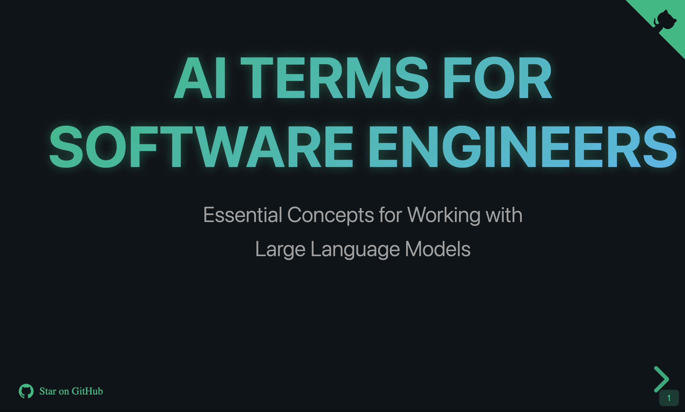

# AI Terms for Software Engineers

[](https://foyzulkarim.github.io/ai-terms-for-engineers/)
[](LICENSE)
[](https://revealjs.com/)

> A comprehensive, interactive presentation covering essential AI and LLM concepts for software engineers

**🔗 [View Live Presentation](https://learn.playwithllm.com/)**

[](https://learn.playwithllm.com/)

## 📺 Video Series

This presentation is now available as a comprehensive **26-episode video series** on YouTube! Each episode dives deep into one AI concept with practical examples and real-world applications.

[](YOUR_YOUTUBE_PLAYLIST_URL)

**[▶️ Watch the complete series on YouTube](YOUR_YOUTUBE_PLAYLIST_URL)**

### 📝 Video Transcripts

All video transcripts are available in the [`/transcripts`](transcripts/) directory. Read them as:
- **Individual episodes** - Each transcript stands alone with examples and code
- **Complete handbook** - Read all 26 episodes in sequence for comprehensive learning
- **Quick reference** - Search for specific concepts across all transcripts

[Browse all transcripts →](transcripts/README.md)

## 📖 About

This presentation provides software engineers with a clear, structured understanding of Large Language Models (LLMs) and AI concepts. From foundational machine learning principles to production deployment concerns, it covers everything you need to know to work effectively with AI in modern applications.

Perfect for:
- Software engineers entering the AI/ML space
- Teams building LLM-powered applications
- Technical talks and workshops
- Self-paced learning and reference

## 🎯 What's Covered

The presentation is organized into 7 logical sections:

### 1. Foundation (History & Architecture)
- Machine Learning basics
- The Transformer revolution (2017)
- Evolution to Large Language Models

### 2. Core Concepts (Building Blocks)
- Parameters and model architecture
- Tokens and tokenization
- Context windows
- GPU memory requirements (VRAM)

### 3. Data & Retrieval
- Embeddings and vector representations
- Vector databases
- Retrieval-Augmented Generation (RAG)

### 4. Model Behavior (Training & Optimization)
- Inference parameters (temperature, top-p, top-k)
- Fine-tuning techniques
- RLHF (Reinforcement Learning from Human Feedback)
- Quantization strategies

### 5. Working with LLMs (Application Layer)
- Prompt engineering
- Structured outputs
- Function calling
- Agent workflows
- Multi-modal models

### 6. Production & Integration
- LLM APIs and providers
- Model selection strategies
- Evaluation and benchmarking

### 7. Production Concerns
- Handling hallucinations
- Cost optimization
- Security considerations

## ✨ Features

- **🎨 Beautiful Design** - Modern dark theme with smooth gradient accents
- **📱 Responsive** - Works perfectly on desktop, tablet, and mobile
- **⌨️ Fragment Animations** - Each bullet point appears one at a time for better presentation flow
- **🎯 Section Dividers** - Clear visual separation between major topics
- **📊 Progress Tracking** - Built-in slide numbers and progress bar
- **🔍 Overview Mode** - Press `Esc` to see all slides at once

## 🚀 Quick Start

### View Online
Simply visit: **https://learn.playwithllm.com/**

### Run Locally
1. Clone the repository
```bash
git clone https://github.com/foyzulkarim/ai-terms-for-engineers.git
cd ai-terms-for-engineers
```

2. Open `index.html` in your browser
```bash
# On macOS
open index.html

# On Linux
xdg-open index.html

# On Windows
start index.html
```

Or use a local web server:
```bash
# Python 3
python -m http.server 8000

# Node.js
npx http-server
```

Then visit `http://localhost:8000`

## ⌨️ Keyboard Controls

| Key | Action |
|-----|--------|
| `Space` / `→` | Next slide/fragment |
| `←` | Previous slide/fragment |
| `Home` | First slide |
| `End` | Last slide |
| `Esc` / `O` | Slide overview mode |
| `F` | Fullscreen mode |
| `S` | Speaker notes view |
| `?` | Show all shortcuts |

## 🎓 Usage Tips

### For Presenters
1. Press `S` to open speaker view with notes and timer
2. Use `Esc` to see slide overview and jump to sections
3. Press `F` for fullscreen presentation mode
4. Practice with fragments to master timing

### For Self-Study
1. Use `Esc` to see all slides and navigate freely
2. Take notes on key concepts
3. Revisit specific sections as needed
4. Use the progress bar to track your learning

## 🛠️ Built With

- [Reveal.js](https://revealjs.com/) - The HTML Presentation Framework
- Pure HTML/CSS/JavaScript - No build process required
- CDN-hosted dependencies - Works anywhere

## 📝 Related Resources

- **[Video Transcripts](transcripts/)** - Complete transcripts for all 26 episodes, readable as a handbook
- **[YouTube Series](YOUR_YOUTUBE_PLAYLIST_URL)** - Video walkthroughs of each concept with examples
- **[Live Presentation](https://learn.playwithllm.com/)** - Interactive slide deck for self-paced learning

## 🤝 Contributing

Found a typo or want to suggest improvements? Contributions are welcome!

1. Fork the repository
2. Create your feature branch (`git checkout -b feature/improvement`)
3. Commit your changes (`git commit -m 'Add some improvement'`)
4. Push to the branch (`git push origin feature/improvement`)
5. Open a Pull Request

## 📄 License

This project is licensed under the MIT License - see the [LICENSE](LICENSE) file for details.

## 👤 Author

**Foyzul Karim**

- GitHub: [@foyzulkarim](https://github.com/foyzulkarim)
- YouTube: [Foyzul Karim](https://www.youtube.com/@foyzul)
- LinkedIn: [Foyzul Karim](https://www.linkedin.com/in/foyzul/)
- Twitter: [@foyzul_karim](https://twitter.com/foyzul_karim)

Senior Software Engineer (15+ Yrs) • Node.js, React, TypeScript, C# & AWS • Architecting High-Performance Scalable Systems • Innovating with Agentic AI

## 🌟 Acknowledgments

- Inspired by the groundbreaking "Attention Is All You Need" paper
- Built for the software engineering community
- Special thanks to the Reveal.js team for the amazing presentation framework

## 📊 Stats

- 26 slides covering essential AI/LLM concepts
- 7 organized sections for structured learning
- Fragment animations for better presentation flow
- Mobile-responsive design
- Zero build dependencies

---

⭐ **Star this repository** if you find it helpful!

🔗 **Share with colleagues** who are learning about AI/LLMs

💬 **Open an issue** if you have questions or suggestions
